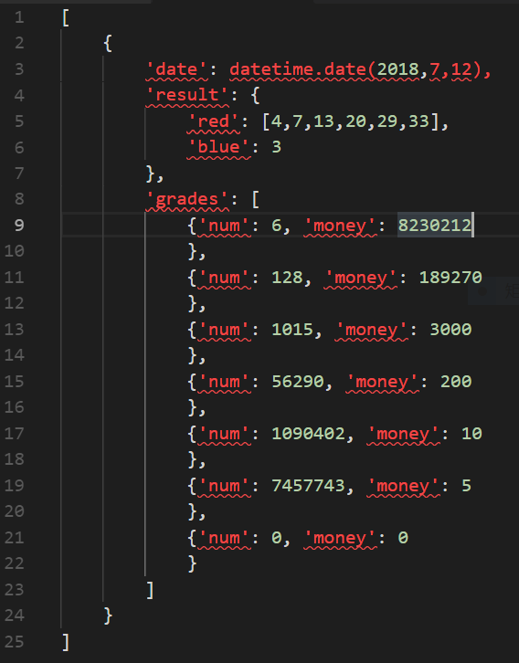

# apple
获取彩票历史数据，做简单数据分析

## 示例
```python
Python 3.6.4 |Anaconda, Inc.| (default, Jan 16 2018, 10:22:32) [MSC v.1900 64 bit (AMD64)] on win32
Type "help", "copyright", "credits" or "license" for more information.
>>> from lottery import get_history as get_his
>>> his_data = get_his("七星彩", count=1)
>>> print(his_data)
[{'date': datetime.date(2018, 7, 13), 'result': [8, 3, 4, 4, 0, 4, 9], 'grades': [{'num': 0, 'money': 0}, {'num': 11, 'money': 33462}, {'num': 102, 'money': 1800}, {'num': 2003, 'money': 300}, {'num': 27850, 'money': 20}, {'num': 307116, 'money': 5}]}]
>>> his_data = get_his("双色球", count=1)
>>> print(his_data)
[{'date': datetime.date(2018, 7, 12), 'result': {'red': [4, 7, 13, 20, 29, 33], 'blue': 3}, 'grades': [{'num': 6, 'money': 8230212}, {'num': 128, 'money': 189270}, {'num': 1015, 'money': 3000}, {'num': 56290, 'money': 200}, {'num': 1090402, 'money': 10}, {'num': 7457743, 'money': 5}, {'num': 0, 'money': 0}]}]
>>>
```


